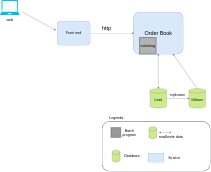
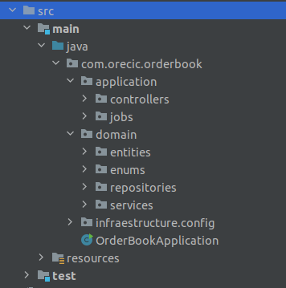

# order-book

## Requisitos

Atores
* Comprador
* Vendedor

Os **requisitos funcionais** providos pelo desafio.
* Permitir usuários enviar ordens de compra e venda de um ativo chamado Vibranium como MVP.
* Fazer os débitos e créditos na carteira dos usuários após as ordens serem executadas com sucesso.

Em um **order book(livro de ofertas)**, há muitas regras envolvidas no seu funcionamento como tipo de ordens que podem ser lançadas(ordens a preço de mercado, ordens com limite, ordens com proteção, ordens com stop/loss etc), horário de negociação, duração da ordem no book, execução parciais ou totais das ordens.

**Premissas:**
* A solução irá aceita apenas ordens com preço limite.
* As ordens seram com execução total, ou seja, deverá haver uma oferta de venda com preço e quantidade igual.
* Ordens lançadas seram mantidas até haver um match igual de venda.
* Interfaces não está no escopo do código.
* Login e credencias não serão contemplados na solução do código.
* Gerenciamento de carteira do usuário.

**Requisitos não funcionais:**
* Scalability: Nossa aplicação deve ser capaz de atender requisições se o throughput aumentar.
* Performance: Devemos responder em um tempo aceitável com máximo throughput possível.
* Reliability: Os débitos e créditos devem ser feitos de forma correta.
* Fault tolerance/Resilience: O sistema deve continuar responder mesmo se uma parte cai.
* Concurrency: O order book não permite concorrência.
* Security: Nosso order book poderá receber requisições de robôs automatizados.

## Arquitetura

[Order Book - Context Diagram](docs/order-book-context-diagram.md)

[Order Book - View](docs/order-book-view.md)

O design do código tentou seguir uma clean architecture, desacoplando as camadas e isolando o domain.

## ADR (Architectural Decision Record)
Contém o racional para escolha da arquitetura e componentes pertinentes.

* ADR 001 - [Monolith Style](https://github.com/monteirocicero/order-book/blob/main/ADRs/ADR001-monolith-architecture.md)
* ADR 002 - [Batch Matching](https://github.com/monteirocicero/order-book/blob/main/ADRs/ADR001-monolith-architecture.md)
* ADR 003 - [Leader/Follower Database](https://github.com/monteirocicero/order-book/blob/main/ADRs/ADR001-monolith-architecture.md)

## Backlog
* Permitir ordem de compra a preço de mercado(imediata), compra com proteção e compra com stop/loss.
* Disponibilizar execução de ordens parcias.
* Permitir aluguel de vibranium.
* Possibilitar negociar opções de vibranium.

## Como executar local
[Instruções para execução](docs/how-to-run-the-application.md)

## Load testing
[Resultados](docs/load-testing.md)
