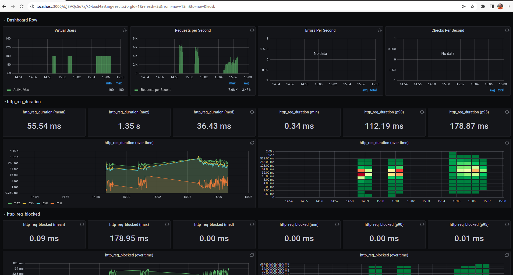

# Load Testing
Load testing usando [K6](https://k6.io/) feito usando uma Intel® Core™ i7-7500U CPU @ 2.70GHz × 4 com 16GB RAM com os containers executando.

Comando usado para o teste:
```shell
 k6 run --out influxdb=http://localhost:8086/myk6db --vus 100 --duration 30s script.js
```

K6 integrado com influxdb e grafana para visualização dos dados.




> Rodando em containers local


