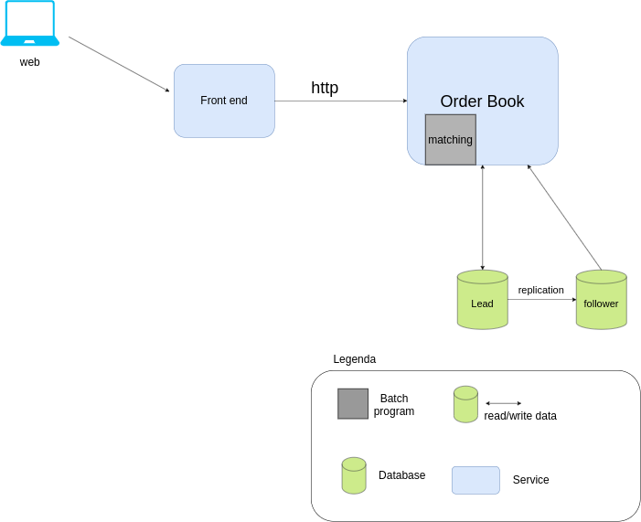

## Order Book Service View
Serviço que será responsável por receber ordens de compra e venda de Vibranium e fazer o matching das ordens.

**Batch program**
* Job scheduler que rodará a cada x tempo e dar matching de ordens de compra e venda com mesmo preço e quantidade e atualizar as carteiras dos usuários.
* Podemos usar um schedule distribuído para processar mais dados, para isso usamos o banco de dados como uma fila.

**Database**
* Estamos usando um postgres. para ter high availability, podemos ter lead/follower para caso o lead caia temos cópia dos dados em outro nó.

## Comportamento

